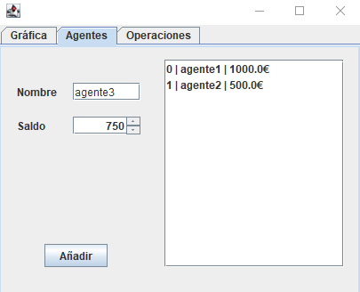
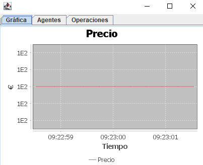

<h1 align="center">Broker de Bolsa</h1>

Iván Duro Fernández

Aplicación que simula un pequeño mercado de compra y venta entre Agentes a través de una gráfica realizada por varias interfaces gráficas

- - -

## Requisitos del Proyecto

1. **Java 25** - El proyecto se realizó utilizando Java 25, por lo que para su ejecución se recomienda ejecutarlo en esa versión o en versiones futuras superiores a ella
2. **Maven** - También cabe destacar que se completo en Maven, con lo que las librerías que se necesitaron, están cubiertas en el archivo pom.xml en el que se hablará después
3. **Netbeans** - Por útlimo, se utilizó el IDE Netbeans en el que se escribió el código y se añadiron las interfaces gráficas, por lo que se recomienda, aunque no es necesario, utilizar este IDE para su ejecución

- - -

## Dependencias

Como se explicó antes, este proyecto está realizado en Maven, por lo que las dependecias que se necesitaron, que para el proyecto fueron 2 concretamente, están añadidas en el pom.xml.
- La primera dependencia que se añadió fue el **JFreeChart**, que su función es pintar la gráfica en tiempo real a través de la interfaz gráfica

  

- La segunda dependencia fue **Gson** que hace la función de guardar los agentes y las operaciones en un archivo de esa extensión, con la casuistica de que no se utilizó, ya que estos datos se guardan en archivos .TXT para que el desarrollo del código fuera más fácil pero se deja la dependencia instalada por si en el futuro se necesita o se quiere usar esa extensión 

  

- - - 

## Estructura del proyecto

  

La estructura del proyecto tiene los siguiente paquetes y clases relizados en un modelo MVC - Modelo, Vista y Controlador:

- 📦 **com.mycompany.brokerdebolsarecuperacion**
  - 📄 BrokerDeBolsaRecuperacion.java
- 📦 **controller**
  - 📄 Broker.java
  - 📄 FrontController.java
  - 📄 GraficaBolsa.java
  - 📄 TareaBolsa.java
- 📦 **model**
  - 📄 Agente.java
  - 📄 Operacion.java
- 📦 **persistencia**
  - 📄 GuardarAgente.java
  - 📄 GuardarOperacion.java
- 📦 **view**
  - 📄 MainFrame.java

- - -

## Explicación funcionalidades

Al ejecutar el proyecto, lo que nos aparece es una ventana con 3 pestañas intercambiables entre sí en la que podemos ver, así de primeras, la primera pestaña en la que aparece la gráfica que se actualiza en tiempo real como se muestra en la imagen de abajo

  

La segunda pestaña, llamada Agentes, tiene la función de crear los agentes indicándole el nombre a través de un **TextField**, el saldo a través de un **Spiner** en el que el salario se introducirá por un número en formato double y a la derecha un **ScrollPane** en el que hay una **JList** en el que se verán los agentes que se van añadiendo en la aplicación con un botón de añadir en el pie de la vetana.

Cuando se añade se ve en la lista el nombre del agente, el saldo y el ID a la izquierda de todo, en el que irá incrementando a medida que se van añadiendo estos agentes

  

Para la útltima pestaña, como se ve en la imágen, es la pestaña de operaciones, en la que hay un **ComboBox** en el que se puede escoger el agente añadido anteriormente en la pestaña mencionada, el tipo, que es la acción que quiere realizar el agente, puediendo ser de **Compra** y otra de **Venta**, el precio a la que quiere que se ralealice la operación, y la cantidad, siendo estos dos últimos un **Spinner** a indicar la cantidad
